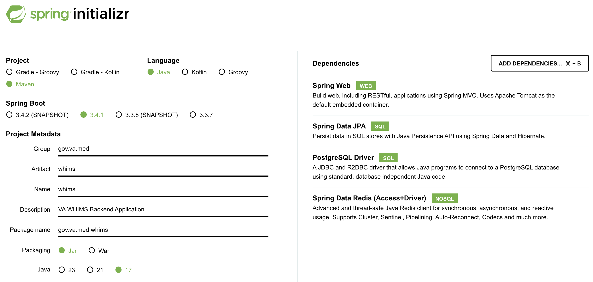

# Development Log for VA WHIMS Application

## January 5, 2025
Initial GitHub Copilot prompt to kick things off:  

Please help me create a web application that has a frontend using vite, react, and typescript. The backend uses java spring boot, redis, and postgresql. I would like to use an MVC design. The web application will have a lefthand side menu bar that expands and collapses. The top area of the website will have a vertical section that sticks to the top of the page and has standard UI components. Explain the folder structure and provide instructions for getting started developing and running the application.  

### Folder Structure
Here's a general folder structure for your project:
```text
my-web-app/
├── backend/
│   ├── src/
│   │   ├── main/
│   │   │   ├── java/
│   │   │   │   └── com/
│   │   │   │       └── example/
│   │   │   │           └── mywebapp/
│   │   │   │               ├── controller/
│   │   │   │               ├── model/
│   │   │   │               ├── repository/
│   │   │   │               ├── service/
│   │   │   │               ├── MyWebAppApplication.java
│   │   │   ├── resources/
│   │   │       ├── application.properties
│   │   │       ├── static/
│   │   │       └── templates/
│   ├── build.gradle
│   └── settings.gradle
├── frontend/
│   ├── public/
│   ├── src/
│   │   ├── components/
│   │   │   ├── Header.tsx
│   │   │   ├── Sidebar.tsx
│   │   │   └── App.tsx
│   │   ├── assets/
│   │   ├── App.css
│   │   ├── index.tsx
│   │   └── react-app-env.d.ts
│   ├── tsconfig.json
│   ├── vite.config.ts
│   └── package.json
└── README.md
```

Prompt to use Maven instead of gradle:  
Please update the code and folder structure to use Maven instead of Gradle.  

### Folder Structure (updated to use Maven)
Here's the general folder structure for your project with Maven:
```text
my-web-app/
├── backend/
│   ├── src/
│   │   ├── main/
│   │   │   ├── java/
│   │   │   │   └── com/
│   │   │   │       └── example/
│   │   │   │           └── mywebapp/
│   │   │   │               ├── controller/
│   │   │   │               ├── model/
│   │   │   │               ├── repository/
│   │   │   │               ├── service/
│   │   │   │               ├── MyWebAppApplication.java
│   │   │   ├── resources/
│   │   │       ├── application.properties
│   │   │       ├── static/
│   │   │       └── templates/
│   ├── pom.xml
├── frontend/
│   ├── public/
│   ├── src/
│   │   ├── components/
│   │   │   ├── Header.tsx
│   │   │   ├── Sidebar.tsx
│   │   │   └── App.tsx
│   │   ├── assets/
│   │   ├── App.css
│   │   ├── index.tsx
│   │   └── react-app-env.d.ts
│   ├── tsconfig.json
│   ├── vite.config.ts
│   └── package.json
└── README.md
```

### Backend Setup (Java Spring Boot with Maven)
Step 1: Create a new Spring Boot project

1\. Create a new directory for the backend:
```bash
mkdir backend
cd backend
```

2\. Use Spring Initializr to generate a new Spring Boot project with dependencies:  

- Visit [Spring Initializr](https://start.spring.io/)
- Select:
    - Project: Maven Project
    - Language: Java
    - Spring Boot: (latest version)
    - Project Metadata: Fill in your group, artifact, and name
    - Dependencies:
        - Spring Web
        - Spring Data JPA
        - PostgreSQL Driver
        - Spring Data Redis

Here are my Spring Initializr settings:


These settings produced: whims.zip  

3\. Download the project and extract it into the backend directory.

Step 2: Configure PostgreSQL and Redis
- Edit src/main/resources/application.properties:

```text
# PostgreSQL configuration
spring.datasource.url=jdbc:postgresql://localhost:5432/mydatabase
spring.datasource.username=myuser
spring.datasource.password=mypassword
spring.jpa.hibernate.ddl-auto=update

# Redis configuration
spring.redis.host=localhost
spring.redis.port=6379
```

Step 3: Create the MVC Structure
- Create the necessary packages and classes under src/main/java/com/example/mywebapp/:

Step 4: Build and run the backend
- Open a terminal and navigate to the backend directory.
- Run the application:
```bash
mvn spring-boot:run
```

End of day note:  
**_Ran into some trouble running the spring boot app.  
Not sure what's going on. Will take a fresh look at this tomorrow._**

## January 6, 2025
Picking back up on this...


